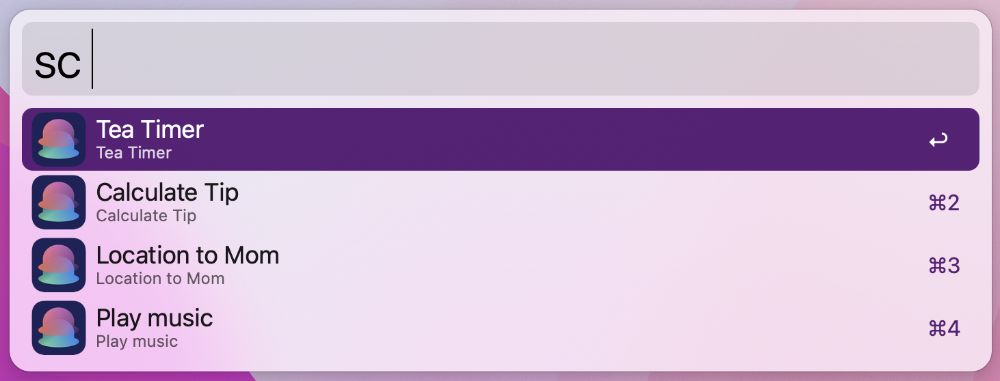

# shortcuts for alfred

run your shourtcuts from alfred!

## requirements
this workflow works with shortcuts which is available in **macos monterey or higher**.

## how to
start with `sc` and type space to see and run the shortcuts you have created in the shortcuts app.
if you only want to filter use shortcuts from a specific folder, add an environment variable `folder` in the workflow-config.

